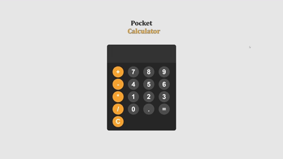

# Pocket Calculator

## Description

Looking for a reliable and easy-to-use calculator? Look no further! This web application is built with vanilla JavaScript, providing a straightforward interface for all your basic mathematical needs. Whether you're a student, professional, or just need to make a quick calculation, this calculator is the perfect tool for you. Get started with addition, subtraction, multiplication, and division, all within a clean and user-friendly design.

## Table of Contents

1. [Screenshots](#screenshot)
2. [License](#license)
3. [Links](#links)
4. [Questions](#support)

---

## Screenshots

---

## License

[MIT](url)

## Links

#### [Repo](https://github.com/8BitGinger/pocket-calc)

#### [Deployed](https://8bitginger.github.io/pocket-calc/)

#### [Portfolio](https://ryanfann.netlify.app/)

## Questions

Reach out for Questions or Support here:

### Email:

ryan.fann@gmail.com

#### GitHub Username:

[8BitGinger](https://github.com/8BitGinger)
