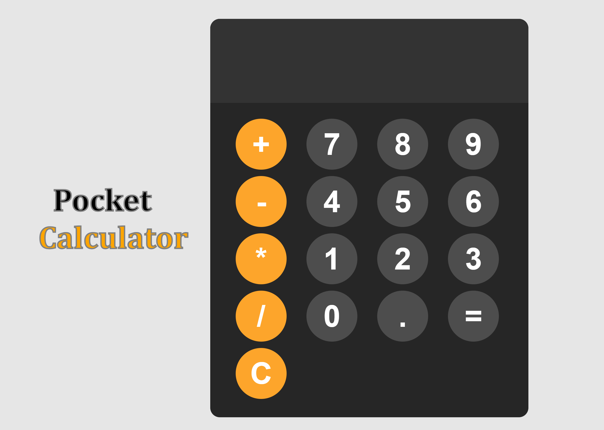

# Pocket Calculator

## Description

A simple Calculator Application

## Table of Contents

1. [Screenshot](#screenshot)
2. [License](#license)
3. [Links](#links)
4. [Questions](#support)

---

## Screenshot

---

## License

[MIT](url)

## Links

### Repo Link:

https://github.com/8BitGinger/pocket-calc

### Deployed Link:

https://8bitginger.github.io/pocket-calc/

## Questions

Reach out for Questions or Support here:

### Email:

ryan.fann@gmail.com

#### GitHub Username:

[8BitGinger](https://github.com/8BitGinger)
